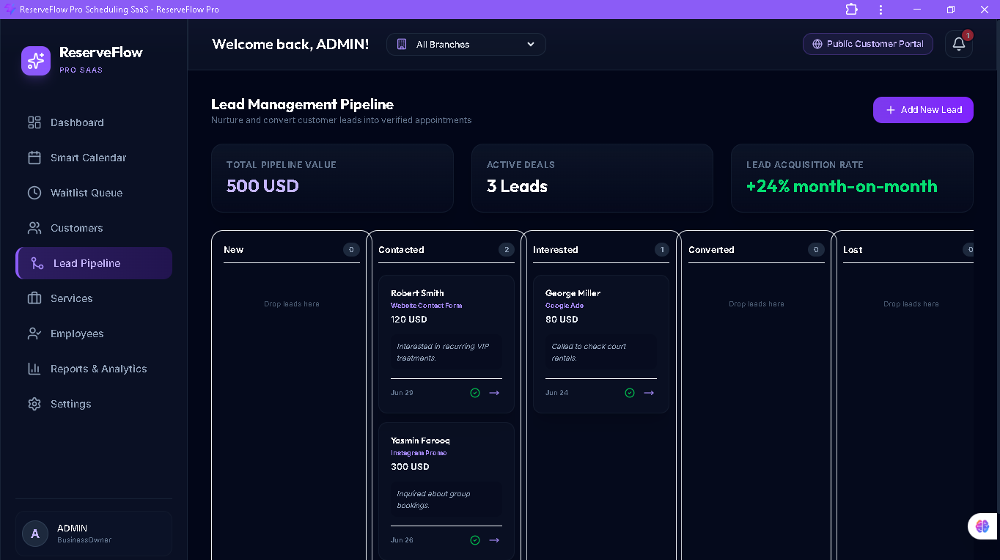
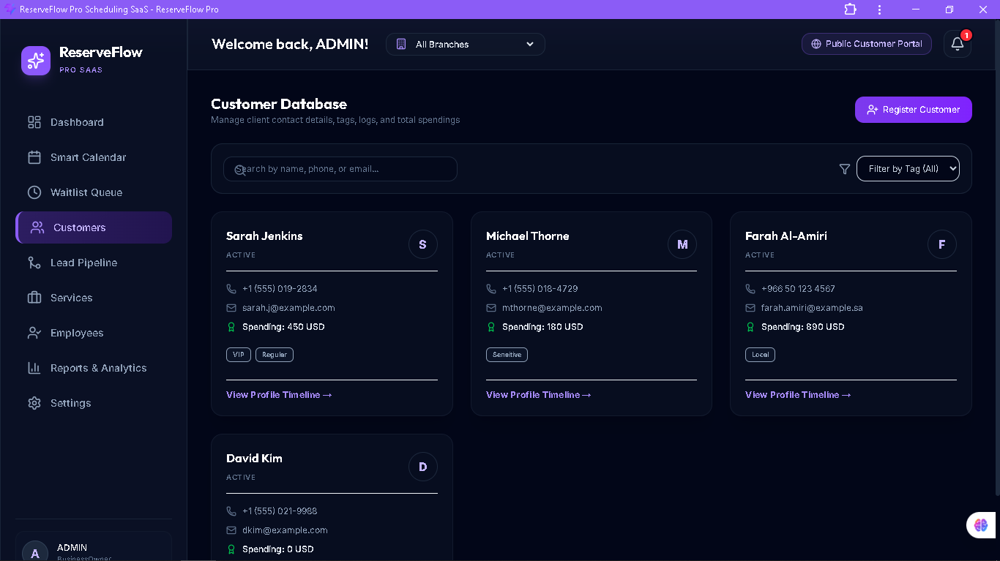
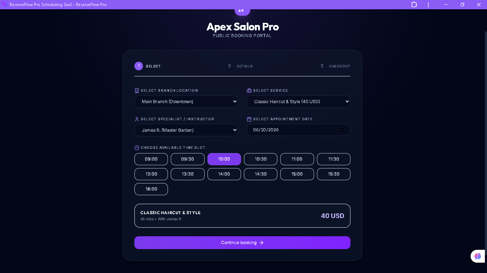

[](https://reserve-flow-pro.vercel.app)
[](https://react.dev/)
[](https://www.typescriptlang.org/)
[](https://firebase.google.com/)
[](#)


# ReserveFlow Pro

Enterprise Appointment & Reservation Management Platform built for businesses that require real-time booking, scheduling, customer management, and staff coordination.

## Live Demo

🔗 **Demo:** reserve-flow-pro.vercel.app

Demo Access

This project is currently running in Demo Mode.

Email: admin@reserveflow.com
Authentication: No password required
Role: Select any available role from the dropdown menu to explore the application.

Note: This is a portfolio demonstration. Production authentication and backend services are planned for a future release.

---

## Features

* Appointment & reservation management
* Customer management
* Staff scheduling
* Real-time dashboard
* Responsive design
* Progressive Web App (PWA)
* Secure authentication
* Modern UI

---

## Tech Stack

* React
* TypeScript
* Vite
* Firebase
* Tailwind CSS

---

## Screenshots

### Login


### Dashboard


### Reservations


### Customers


### Public Booking Portal


---

## Run Locally

```bash
git clone https://github.com/ebroboooo/ReserveFlow-Pro.git

cd ReserveFlow-Pro

npm install

npm run dev
```

---

## Roadmap

* Email notifications
* SMS reminders
* Calendar integrations
* Analytics dashboard
* Multi-branch support

---

## Author

**Ebram Sherif**

GitHub: https://github.com/ebroboooo
