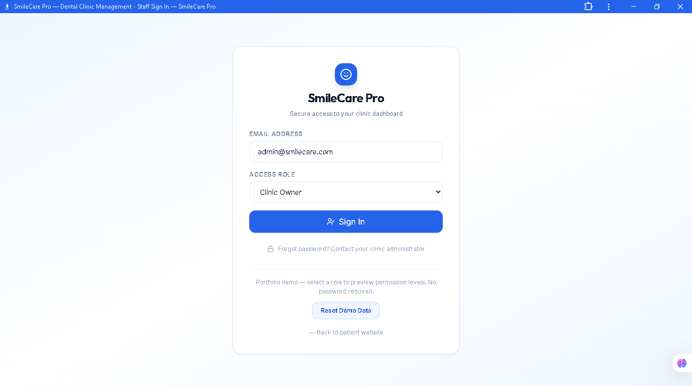
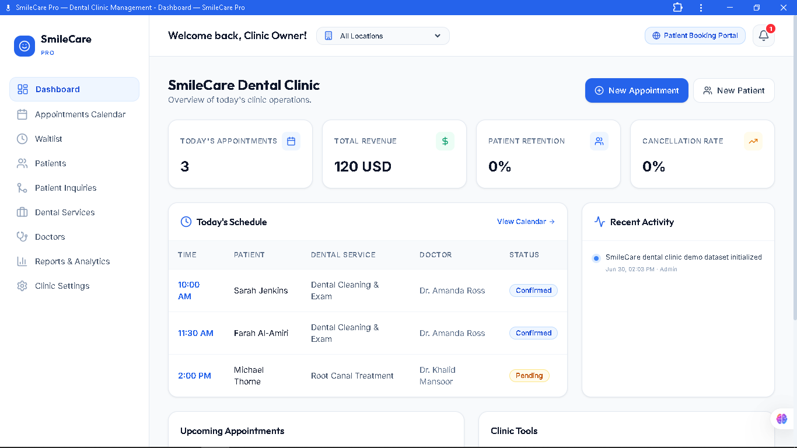
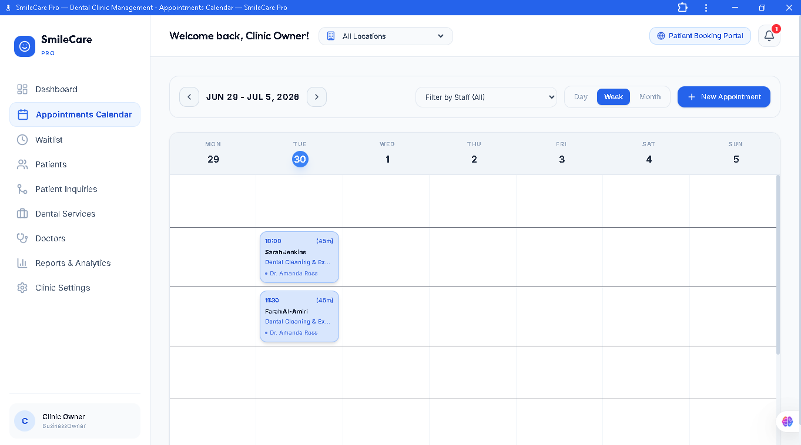
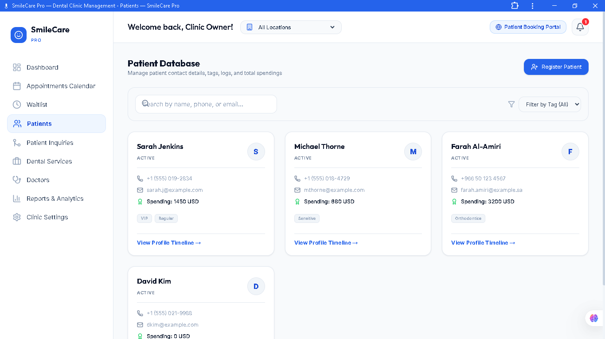
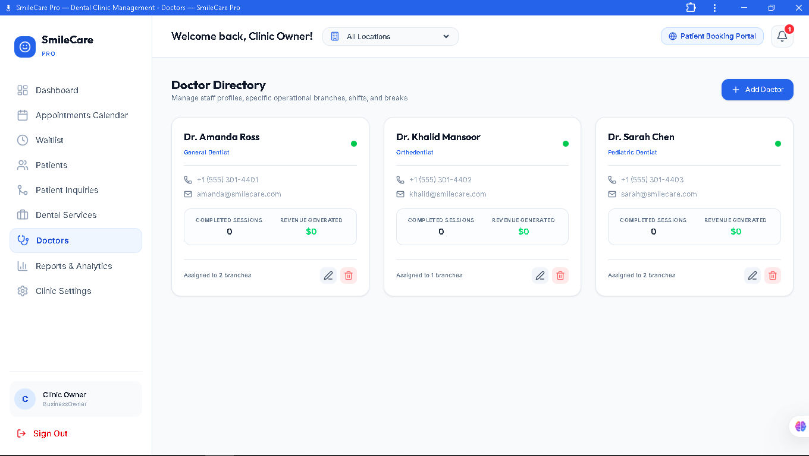
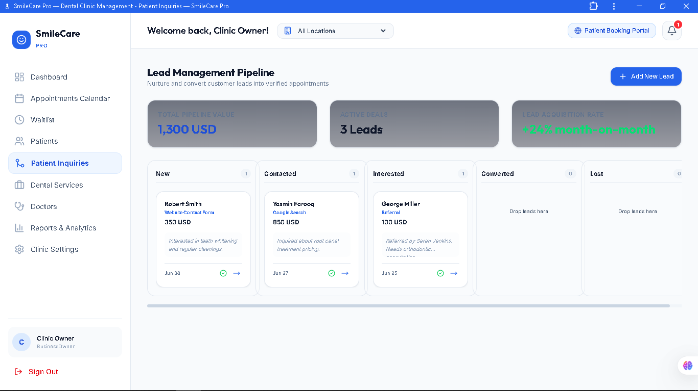
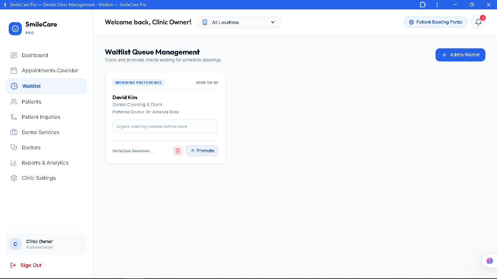
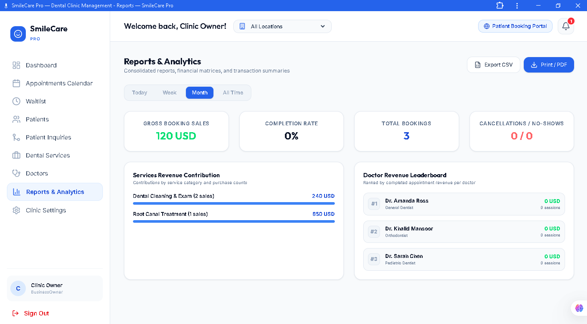
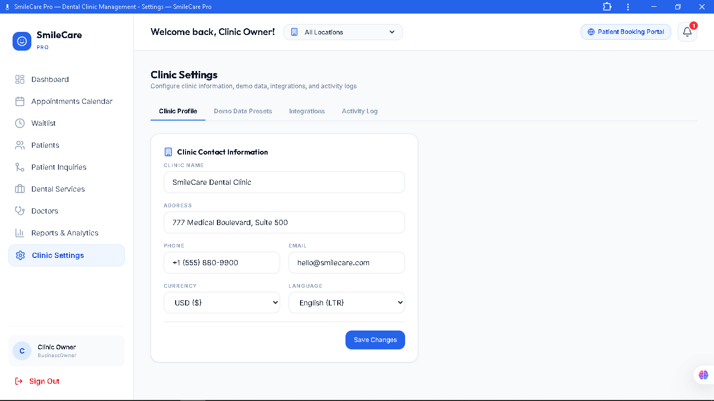

# SmileCare Pro

<p align="center">
  
</p>

<p align="center">

[](https://smilecarecloud.vercel.app)
[](https://react.dev/)
[](https://www.typescriptlang.org/)
[](https://firebase.google.com/)
[](https://tailwindcss.com/)
[](#license)

</p>

> **Modern Dental Clinic Management SaaS** built with **React, TypeScript, Firebase, Tailwind CSS and Vite**.  
> Designed as a production-style portfolio project demonstrating appointment scheduling, patient management, doctor coordination, reporting, multilingual support and a responsive administration dashboard.

## 🌐 Live Demo

**Demo:** https://smilecarecloud.vercel.app

### Demo Access

| Item | Value |
|------|-------|
| Staff Login | `/login` |
| Email | Any email |
| Password | Not required (Demo Mode) |
| Roles | Super Admin, Clinic Owner, Receptionist, Doctor |

Public Booking Portal:

`/book/smilecare-clinic`

---

# ✨ Highlights

- Public marketing website
- Online appointment booking wizard
- Patient management
- Doctor scheduling
- Calendar management
- Waitlist
- Reports & analytics
- Multi-branch ready
- English & Arabic (RTL)
- Progressive Web App
- Firebase-ready architecture
- Responsive design

---

# 📸 Screenshots

### 🏠 Landing Page


### 🔐 Login


### 📊 Dashboard


### 📅 Calendar


### 👥 Patients


### 👨‍⚕️ Doctors


### 📋 Appointments


### 🦷 Booking Portal


### 📈 Reports


### ⚙️ Settings


---

# 🏥 Core Modules

| Module | Description |
|---------|-------------|
| Landing Website | Professional clinic website with services, doctors and booking CTA |
| Booking Portal | Guided appointment booking with validation |
| Dashboard | Operational overview with KPIs |
| Patients | Manage patient records and history |
| Doctors | Doctor profiles, schedules and availability |
| Appointments | Complete booking lifecycle |
| Waitlist | Queue management |
| Reports | Operational analytics and exports |
| Settings | Clinic configuration |

---

# 👥 User Roles

- Super Admin
- Clinic Owner
- Receptionist
- Doctor

---

# 🛠 Technology Stack

| Category | Technology |
|----------|------------|
| Frontend | React 19 |
| Language | TypeScript |
| Build Tool | Vite |
| Styling | Tailwind CSS 4 |
| Backend | Firebase (optional) |
| Database | Firestore |
| Routing | React Router |
| State | Context API |
| Icons | Lucide React |
| Deployment | Vercel |
| PWA | Supported |

---

# 📂 Project Structure

```text
src/
├── components/
├── context/
├── db/
├── firebase/
├── hooks/
├── pages/
├── types/
├── utils/
└── assets/
```

---

# 🚀 Getting Started

```bash
git clone https://github.com/ebroboooo/SmileCare-Pro.git
cd SmileCare-Pro
npm install
npm run dev
```

Production build

```bash
npm run build
npm run preview
```

---

# ⚙ Environment

```env
VITE_USE_FIRESTORE=false
VITE_FIREBASE_API_KEY=
VITE_FIREBASE_AUTH_DOMAIN=
VITE_FIREBASE_PROJECT_ID=
```

---

# ☁ Deployment

Optimized for Vercel.

For production:

- Configure Firebase credentials.
- Enable Firestore.
- Update environment variables.
- Deploy to Vercel.

---

# 🔒 Security

- Protected routing
- Input validation
- Repository pattern
- Environment-based configuration
- Firebase-ready architecture

---

# ⚡ Performance

- Lazy-loaded routes
- Reusable components
- Responsive UI
- Optimized assets
- Modern React architecture

---

# 🗺 Roadmap

- Firebase Authentication
- Email notifications
- SMS reminders
- Google Calendar sync
- Insurance workflows
- AI scheduling assistant
- Multi-tenant support

---

# 💼 Portfolio Value

SmileCare Pro demonstrates the ability to design and build production-quality business applications including booking systems, CRM functionality, administrative dashboards, multilingual interfaces, responsive layouts and scalable frontend architecture.

---

# 👨‍💻 Author

**Ebram Sherif**

GitHub: https://github.com/ebroboooo

---

## ⭐ If you like this project, consider starring the repository.
